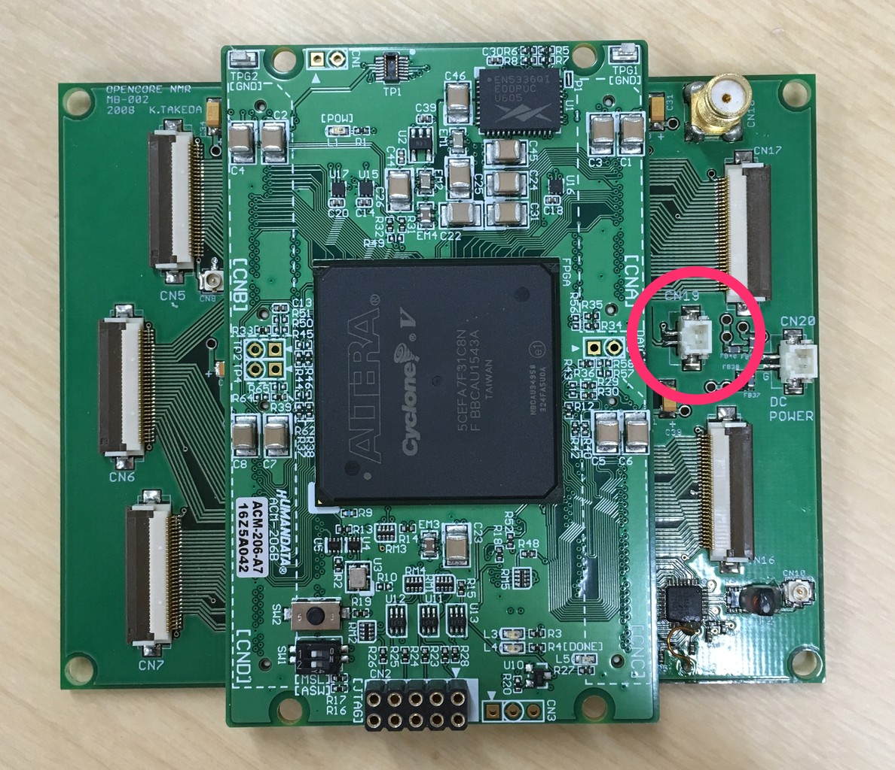
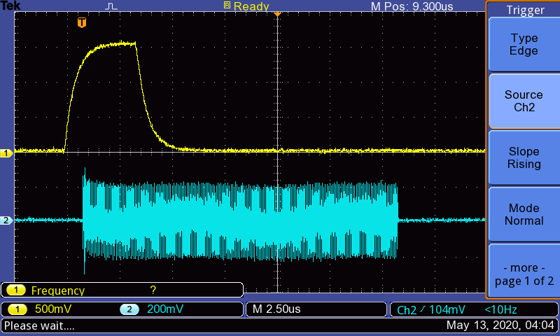
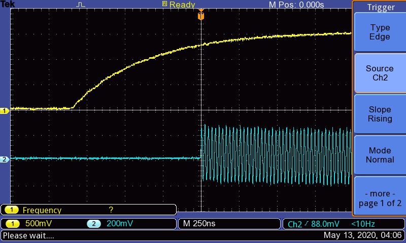

# Waiting for external trigger

12 May 2020 Typo error corrected by KT (exttrig)  
8 Mar 2019 Revised by Kazuyuki Takeda  

- - -

Warning: Do not put extremely high voltage into trigger pin, since it is connected directly to FPGA and can damage it!

To pause implementation of the pulse programmer until the spectrometer receives external trigger signal, use `exttrig` command.

```
Init
  pulse(pw1; gate1, gate2, ...)
  exttrig
  pulse(pw2; gate3, gate4, ...)
Relax
```

Trigger signal is to be fed to CN19 of the mother board. 



The following is how one may connect a source of trigger pulse to the pin:


It is designed to trigger with LVTTL pulse, but experimentally has been found to trigger so long as it receives a roughly square pulse exceeding +1.25 V. As the pin is directly connected to the FPGA, it is recommended not to put high voltage into this pin or else FPGA will be damaged! (+1.5 V square pulse is more than enough to trigger measurement!)

- - -

The following is an example trigger event. A (quite irregular) square pulse is used to trigger a 15 us 40 MHz rf pulse from CH1. The code used is:

```
Init
  exttrig
  pulse(pw1; gate1, gate2, ...)
Relax
```

Though it seems there is a delay between the trigger and the pulse, if one zooms into the trigger in the second figure there is actually almost no delay between reaching the +1.25 V trigger level and firing the pulse.





As can be seen in the second figure, the rf pulse immediately fires upon the trigger reaching the +1.25 V level, and from the timescale, seems to indicate that the rf pulse will fire faster than at least 50 ns after the trigger level is reached.


[Back](../../index.md)
