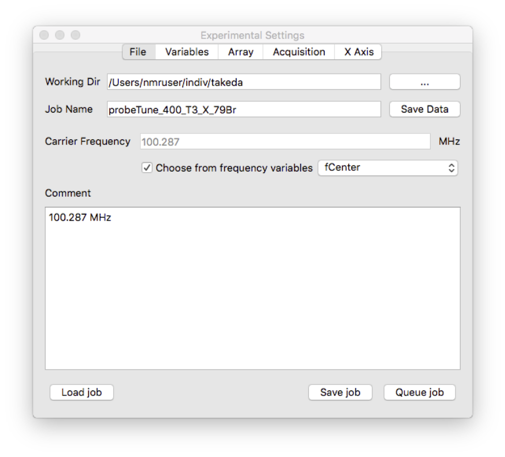
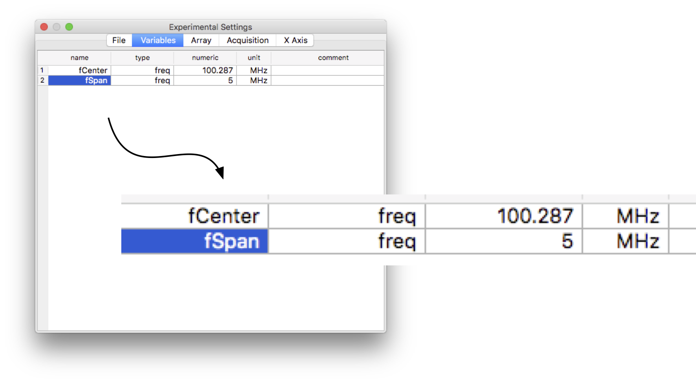
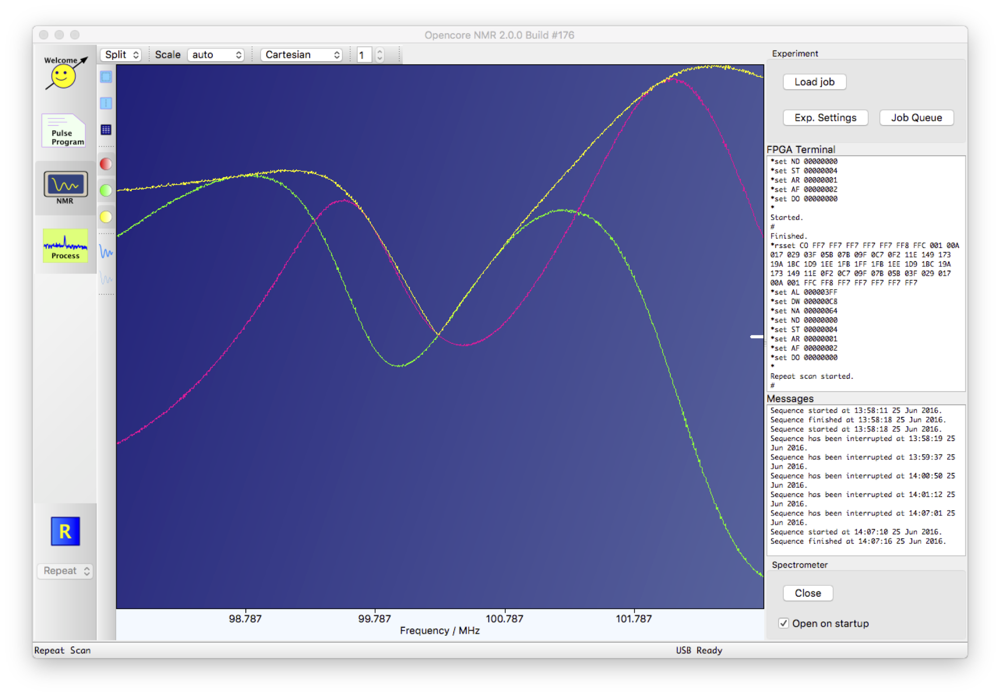
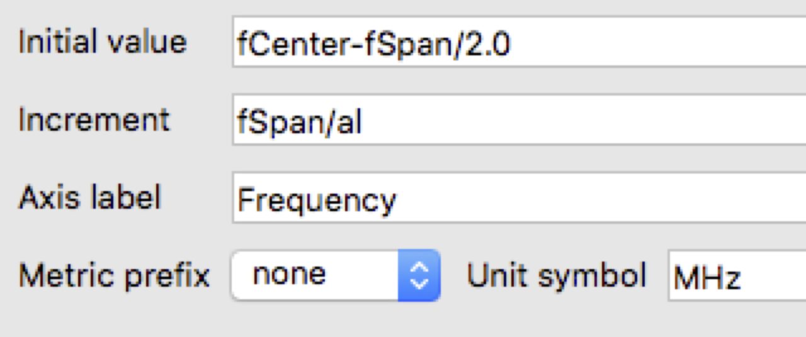
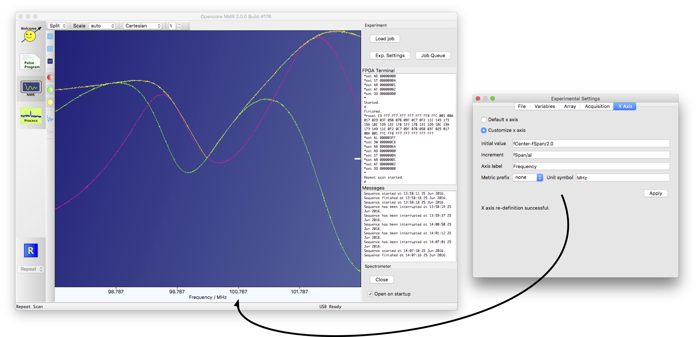
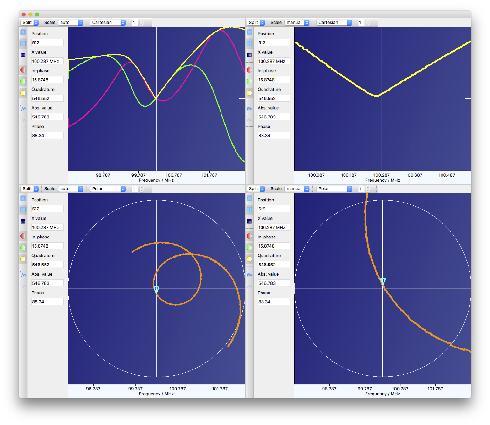


# Probe tuning using an Opencore NMR spectrometer

28 Jan Kazuyuki Takeda
- - -

## Introduction

The purpose of NMR probe tuning is to establish impedance matching at the frequency of interest. A vector network analyzer is a very useful device for tuning the probe, it may not be available. Here, we show an example of probe tuning using an Opencore NMR spectrometer. Here, we assume you have already prepared (in addition to the spectrometer):  

- a probe, or any other devices that you want to test.  
- a coupler, or a power splitter. If you want to tune the probe by monitoring the reflection of the relatively strong, power-amplified rf signals, a coaxial line section with a pickup-port, like the ones shown below, can work.


The idea is to generate an rf pulse *with its frequency swept over*, send it to the probe, and measure the signal reflected back from the probe. One may adjust the trimmer capacitors in such a way that the amplitude of the reflected signal becomes minimum at the frequency of interest.

- - -

## Setup
- Load an appropriate job for probe tuning.  

- In the *Variables* tab on the **Experimental Settings** window, you can see the center frequency and the span of the frequency over which you want to measure.  
- The main part of the pulse program looks like: 
Here, the frequency at channel #1 (F1Freq) is swept by the `sweep` and `endSweep` commands. That is, during any commands sandwiched by `sweep` and `endSweep`, the frequency is swept. The start and stop frequencies are indicated by the two arguments of the sweep command. Here, we use the center frequency $f_{\mathrm{center}}$ and the span $f_{\mathrm{span}}$, so that the start frequency $f_{\mathrm{start}}$ and the stop frequency $f_{\mathrm{stop}}$ are given by
$$
  f_{\mathrm{start}} = f_{\mathrm{center}} - \frac{1}{2} f_{\mathrm{span}},
$$
and
$$
  f_{\mathrm{stop}} = f_{\mathrm{center}} + \frac{1}{2} f_{\mathrm{span}}.
$$


Detailed description of frequency sweeping will be described elsewhere.  

- When you run, e.g., repeat scan, you get signal reflected back from your probe as a function of the frequency. An example of screenshots is shown below.
- A little trick on customizing the format of the horizontal axis may be useful. By default, the x axis represents time. On *X Axis* tab of the **Experimental Settings** panel, you can change the format by selecting *customize x axis*, and edit the initial value, increment, and so on. 
The variables declared in the current pulse program can be used. In this example, the initial value should be `fCenter-fSpan/2.0`, the increment be `fSpan/al` (`al` represents *a*quisition *l*ength). 




- You may want to view the data in various formats. It may be useful to split the plotters.  Here, I split the plotter with four views. ***Top left***: in-phase, quadrature, and absolute signals are displayed. ***Top right***: only the absolute value is displayed, and the data is magnified by limiting the plot range. ***Bottom left***: a polar plot, which is somewhat reminiscent (but *not identical*) to a Smith chart. At least you can tell the critical coupling condition in which the reflection should be minimal so that the marker at the frequency of interest get to the center of the circle. I find this option is extremely useful!. ***Bottom right***: A magnified view of the polar plot, which is also useful to make sure that the impedance matching (and therefore minimum reflection) is established.

***Enjoy!***

- - -

probeTune_ch1.ppg
```
version=2.00;
uses = defaultGates.gate;
transform F1Freq=#+180;

CLK=160;

freq fCenter=74.656;
freq fSpan=5;

amp a=5;

const int AD9858_2GHz_DISABLE=16472;

aux PD=0.1s(Pulse delay);
aux NA=100(Total scans);
aux ND=4(Dummy scans);
aux DW=10u(Dwell time);
aux AL=1024(Acq. length);

phaselist pl=(ch1; x,-x);
acqphase=x,-x;

// Any command before "start" should finish with a semicolon (;).

start   //--- Implementation begins with a "start" command. ---

  pulse(50n; F1FreqRST)
  pulse(50n; F1Freq(setup; AD9858_2GHz_DISABLE))
  delay(10m)
  pulse(5000n; F1Freq(fCenter))
  delay(1m)

Init
  pulse(1m;   RG)
  sweep(F1Freq(fCenter-fSpan/2,fCenter+fSpan/2))
  pulse(50n; ST, RG)
  pulse(dw*al; F1Amp(a), pl, F1_Gate, F1_Unblank, RG)  
  endSweep(F1Freq)
  delay(10m)
relax   

```

probuTune_ch1.nmrjob
```
[Acquisition]
FFTCheckBox=false
QDCheckBox=true
digitalFilterCheckBox=true
inFPGAAccumCheckBox=false
inFPGAAccumSpinBox=1
multipleAcquisitionCheckBox=false
multipleAcquisitionComboBox=0
multipleAcquisitionSpinBox=1
offsetCorrectionCheckBox=false
offsetCorrectionSpinBox=0
phaseReverseCheckBox=false
phaseRotationCheckBox=false
phaseRotationSpinBox=0
replaceRealWithAbsCheckBox=false
separateDataStorageCheckBox=false
separateDataStorageSpinBox=2

[Array]
arrayCheckBox=false
arrayVariables=@Invalid()
dimensions=0

[File]
commentTextEdit=
nameLineEdit=probeTune_ch1
numberOfImportedFiles=0
obsFreqCheckBox=true
obsFreqComboBox=0
obsFreqLineEdit=74.656
ppgFilename=probeTune_ch1.ppg

[Variables]
AL=1024
DW=10
NA=100
ND=4
PD=0.1
a=5
fCenter=74.656000000000006
fSpan=5
names=fCenter, fSpan, a, PD, NA, ND, DW, AL

[xAxis]
customAxisRadioButton=true
defaultAxisRadioButton=false
metricPrefixCombobox=10
unitSymbolLineEdit=MHz
xAxisLabelLineEdit=Frequency
xIncrementLineEdit=fSpan/al
xInitialValueLineEdit=fCenter-fSpan/2
```

[Back to Top](../../index.md)

<!---
, resulting in the minimized reflection of the signal.
プローブチューニングを行う目的は、観測周波数においてインピーダンスを整合させて信号の反射強度を最小にすることにある。整合（マッチングマッチング）時には、ラジオ波信号の照射効率とともにNMR信号の検出効率も最適になる。
　ここではOpencore NMR(2)を用いたプローブチューニングの例を示す。
-->
