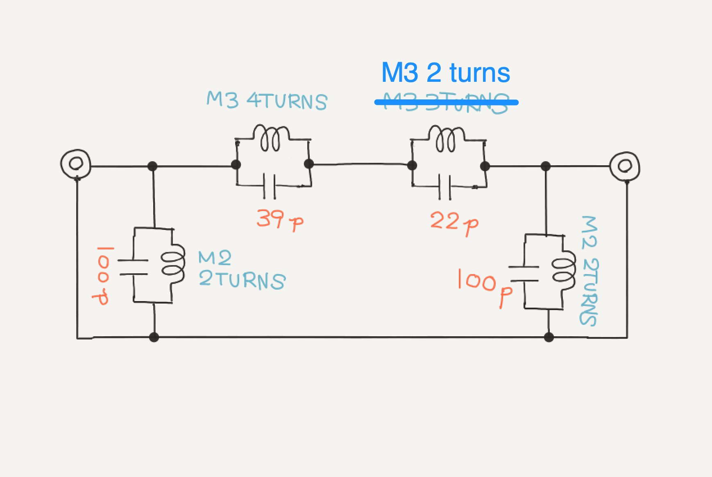
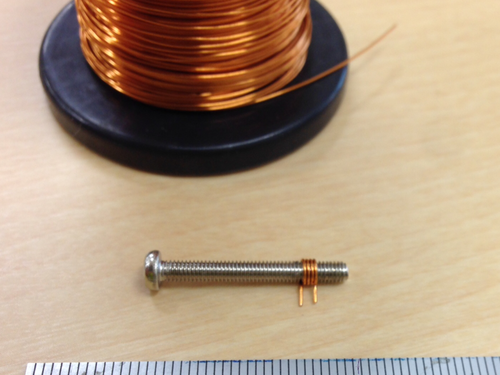
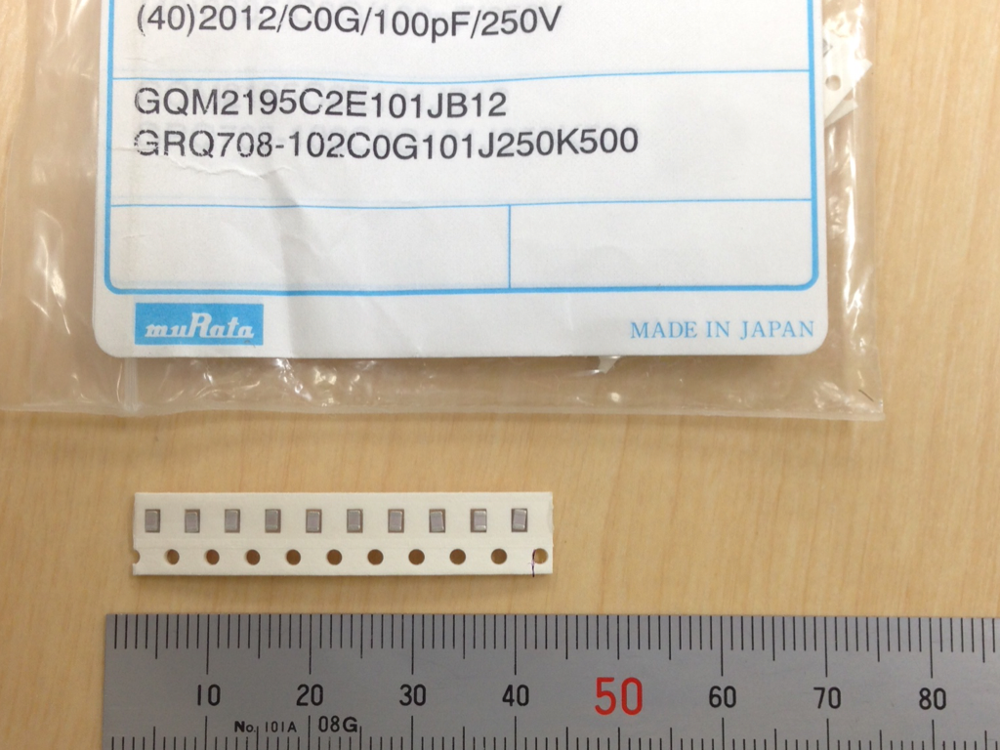
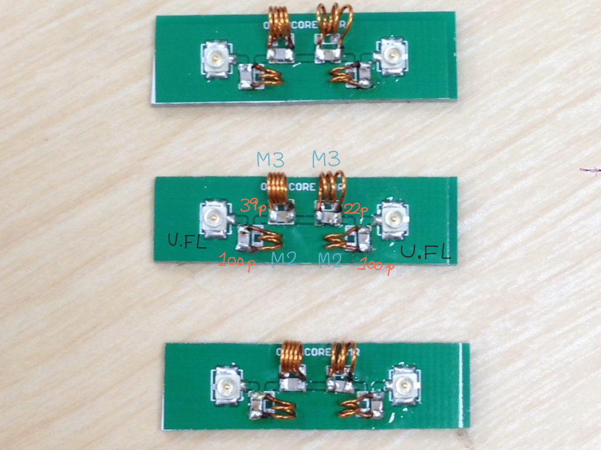
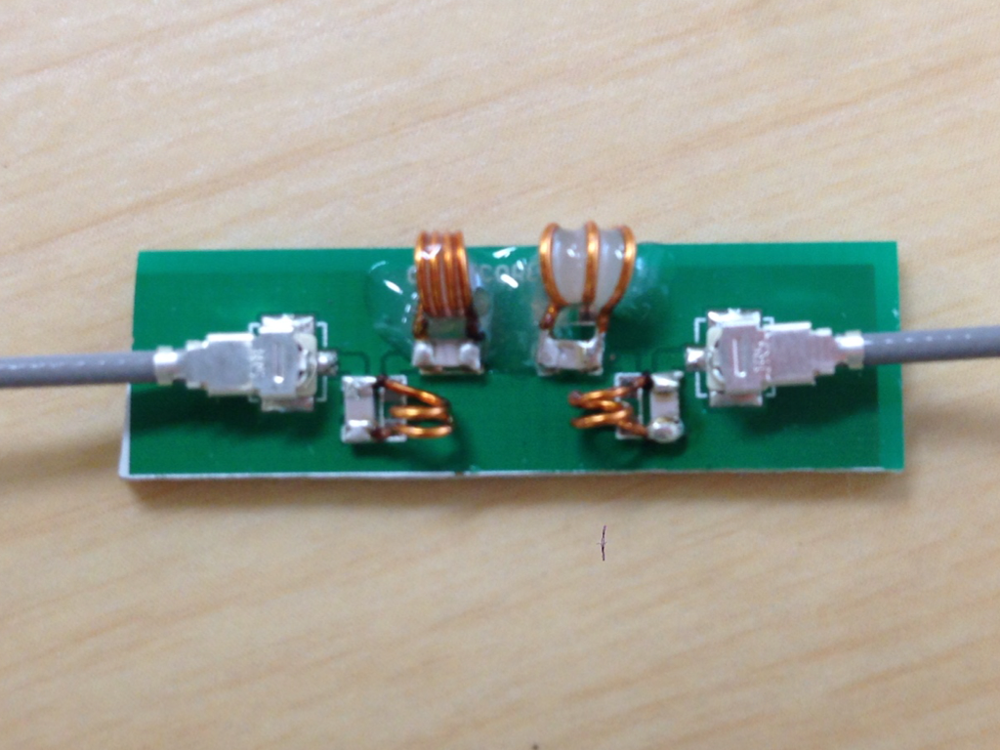
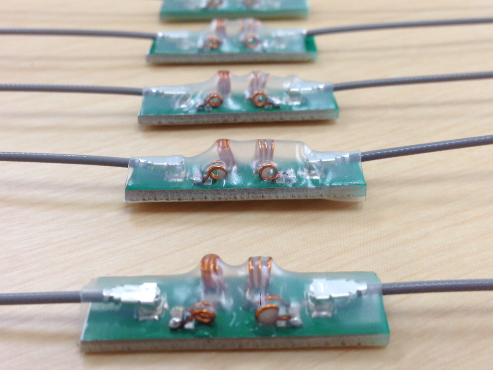

# Making Filters

9 Mar 2019 Revised by Kazuyuki Takeda
26 Feb 2016 Original memo written by Kazuyuki Takeda

##### In this document I show how I make rf filters used in the Opencore NMR spectrometer.

[Back to Top](../../index.md)

- - -

### Introduction
A radio-frequency (rf) filter is an electronic component passing signals with rf ranging over a specific region of interest, while blocking those outside that region. In the Opencore NMR spectrometer as well as in many other electronic devices, rf filters are used for various purposes, such as
- removal of image frequencies generated by an rf mixer,  
- isolation between channels with different frequencies,  
- rejection of noises aliasing into view in analog-to-digital conversion,  
and so on. Here, I demonstrate fabrication of band-pass filters, to be placed between the FPGA mother board and the rf transmitter board of the Opencore NMR spectrometer.

### Fabrication
For this purpose, a circuit board, shown in the following picture, was made. It was cut into pieces. In this example, the longer board was used, while the shorter ones may be useful for making low-pass filters and attenuators.  

In this example, we are interested in such a band-pass filter that passes 180 MHz and rejects 140 MHz and 300 MHz. The circuit diagram is as follows:  

Here, a description of, e.g., "M3 4 turns" means that a coil wound on a M3 screw with a number of turns of four was used. Indeed, it is convenient to use a screw to wind coils. I used a coated wire with a diameter of 0.4 mm, winding on a screw. Later on, the insulating coat was removed at the legs of the coil.  
  

For the capacitors, I found that those of "GQM" series (Murata) work well.

The capacitors and the coils, as well as the surface mount coaxial connectors (U.FL series, HIROSE), were mounted on the board and soldered. Then, the coils were stretched or compressed, while the frequency response of the S21 parameter (transmission) was observed on an network analyzer, so that the insertion loss at 180 MHz was minimal, while the signals at 140 MHz and 300 MHz were reduced significantly (more than 40 dB).

As shown below, the frequency response of the filter was satisfactory.

When I have made sure that the response of the circuit was good, the coils were fixed with epoxy adhesive, to prevent the coils from being deformed by external forces.
  
  

Finally, the filters were covered with insulating hear shrinking tubes.

### Improvement
I found that a two-turns coil, connected in parallel with 22 pF capacitor, works better.

- - -

[Back to Top](../../index.md)
